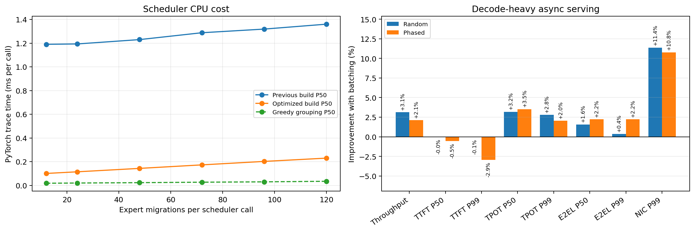

# Four-Node NIXL EPLB Migration Batching Experiment

Both workloads below keep prefix caching enabled. Run four configurations for
each workload: `sync/off`, `sync/on`, `async/off`, and `async/on`.
Migration batching is enabled by default; set it to `false` for rollback.

Environment: Ubuntu 22.04.5, four Quadro RTX 6000 24 GB GPUs (one per
node), NVIDIA 580.167.08, Ray 2.56.1, NIXL 1.3.2, and 10 GbE. The tested
source is the `ilp` branch based on upstream commit `76ff0cdff2`.

## 1. Pull the Code

Run in a Windows terminal:

```bash
ssh cc@192.5.87.75 "cd ~/vllm-ilp && git switch ilp && git pull --ff-only origin ilp"
ssh -J cc@192.5.87.75 cc@10.140.83.20  "cd ~/vllm-ilp && git switch ilp && git pull --ff-only origin ilp"
ssh -J cc@192.5.87.75 cc@10.140.83.141 "cd ~/vllm-ilp && git switch ilp && git pull --ff-only origin ilp"
ssh -J cc@192.5.87.75 cc@10.140.83.105 "cd ~/vllm-ilp && git switch ilp && git pull --ff-only origin ilp"
```

## 2. Start Ray

Run on all four nodes:

```bash
cd ~/vllm-ilp
export PATH=$PWD/.venv/bin:$HOME/.local/bin:$PATH
export LD_LIBRARY_PATH=$PWD/.venv/lib/python3.12/site-packages/nvidia/cu13/lib${LD_LIBRARY_PATH:+:$LD_LIBRARY_PATH}
export NCCL_IB_DISABLE=1 NCCL_SOCKET_FAMILY=AF_INET
export NCCL_SOCKET_IFNAME=eno2 GLOO_SOCKET_IFNAME=eno2
export UCX_TLS=all UCX_NET_DEVICES=eno2 UCX_RCACHE_MAX_UNRELEASED=1024
ray stop --force
```

Run on the head node (`10.31.0.89`):

```bash
ray start --head --node-ip-address=10.31.0.89 --port=6379 \
  --num-gpus=1 --disable-usage-stats
```

Run on the workers, using `10.31.0.87`, `10.31.0.94`, and `10.31.0.91`
respectively as `NODE_IP`:

```bash
ray start --address=10.31.0.89:6379 --node-ip-address="$NODE_IP" \
  --num-gpus=1 --disable-usage-stats
```

`ray status` on the head node should report four active nodes and four GPUs.

## 3. Start vLLM

Choose one configuration before each run:

Every run explicitly uses NIXL, so batching is the only variable between each
off/on pair. On this cluster NIXL uses UCX over the 10 GbE `eno2` network; the
nodes do not have RDMA devices.

```bash
# Synchronous, batching disabled
TAG=01_sync_off
USE_ASYNC=false
USE_BATCHING=false
COMMUNICATOR=nixl

# Synchronous, batching enabled
TAG=02_sync_batching_on
USE_ASYNC=false
USE_BATCHING=true
COMMUNICATOR=nixl

# Asynchronous, batching disabled
TAG=03_async_off
USE_ASYNC=true
USE_BATCHING=false
COMMUNICATOR=nixl

# Asynchronous, batching enabled
TAG=04_async_batching_on
USE_ASYNC=true
USE_BATCHING=true
COMMUNICATOR=nixl
```

Select the result root for the workload being tested:

```bash
# Set WORKLOAD to random or phased.
RESULTS_ROOT=$HOME/benchmarks/eplb_nixl_cache_on_20260901/$WORKLOAD
```

Start a fresh service for every configuration:

```bash
cd ~/vllm-ilp
export PATH=$PWD/.venv/bin:$HOME/.local/bin:$PATH
export LD_LIBRARY_PATH=$PWD/.venv/lib/python3.12/site-packages/nvidia/cu13/lib${LD_LIBRARY_PATH:+:$LD_LIBRARY_PATH}
export NCCL_IB_DISABLE=1 NCCL_SOCKET_FAMILY=AF_INET
export NCCL_SOCKET_IFNAME=eno2 GLOO_SOCKET_IFNAME=eno2
export UCX_TLS=all UCX_NET_DEVICES=eno2 UCX_RCACHE_MAX_UNRELEASED=1024
export VLLM_EPLB_LOG_MIGRATION_STATS=1

MODEL=Qwen/Qwen3-30B-A3B-Instruct-2507
RESULTS=$RESULTS_ROOT/$TAG
mkdir -p "$RESULTS"

EPLB_CONFIG="{\"window_size\":50,\"step_interval\":100,\"num_redundant_experts\":16,\"log_balancedness\":false,\"use_async\":$USE_ASYNC,\"communicator\":\"$COMMUNICATOR\",\"enable_migration_batching\":$USE_BATCHING}"

vllm serve "$MODEL" --dtype float16 --port 8000 \
  --gpu-memory-utilization 0.8 --max-model-len 4096 \
  --enable-prefix-caching --tensor-parallel-size 4 \
  --distributed-executor-backend ray --enable-expert-parallel \
  --enable-eplb --eplb-config "$EPLB_CONFIG" --enforce-eager \
  > "$RESULTS/server.log" 2>&1 &
SERVER_PID=$!

until curl -sf http://127.0.0.1:8000/health >/dev/null; do sleep 5; done

curl -sf http://127.0.0.1:8000/v1/completions \
  -H "Content-Type: application/json" \
  -d "{\"model\":\"$MODEL\",\"prompt\":\"warm up\",\"max_tokens\":10}" \
  > "$RESULTS/warmup.json"

while kill -0 "$SERVER_PID"; do
  echo "$(date +%s) $(cat /sys/class/net/eno2/statistics/{rx_bytes,tx_bytes} | xargs)"
  sleep 1
done > "$RESULTS/nic.tsv" &
NIC_PID=$!
```

## 4. Choose One Benchmark Workload

### A. Random workload

This is the ordinary synthetic workload. It has a 300-token shared prefix and
200 random input tokens. Prefix caching remains enabled by the server.

```bash
vllm bench serve --backend vllm --model "$MODEL" --port 8000 \
  --dataset-name random --random-prefix-len 300 \
  --random-input-len 200 --random-output-len 100 \
  --num-prompts 200 --max-concurrency 32 --seed 0 --temperature 0 \
  --percentile-metrics ttft,tpot,e2el \
  --metric-percentiles 50,90,95,99 --ignore-eos --disable-tqdm \
  --save-result --result-dir "$RESULTS" --result-filename bench.json \
  > "$RESULTS/bench.log" 2>&1
```

Results are stored under:

```text
/home/cc/benchmarks/eplb_nixl_cache_on_20260901/random/
```

### B. Phased English workload

The JSONL contains 256 English prompts in eight ordered phases of 32 requests:
CUDA, literature, mathematics, and biomedical prompts, repeated twice. The
ordered domain changes make the expert distribution move repeatedly. Each
prompt retains a common 223-token prefix, so prefix caching is still exercised.

The exact JSONL used for the experiment is tracked in the repository at:

```text
benchmarks/eplb_rebalance/bench_dataset/eplb_phased_english_256.jsonl
```

It was generated deterministically by
`bench_dataset/generate_phased_english.py`. Its SHA-256 is
`15f80f77caf13b44c1ee715a2db0663daf6a5f884fcbb5769998b46b86482dda`.
The experiment directory also retains an identical archived copy under
`workload/`.

If the custom loader reports that bench support is missing, install its required
dependency on the head node:

```bash
uv pip install --python $HOME/.venv/bin/python pandas
```

Run it without shuffling so the phases remain ordered:

```bash
DATASET=$HOME/vllm-ilp/benchmarks/eplb_rebalance/bench_dataset/eplb_phased_english_256.jsonl

vllm bench serve --backend vllm --model "$MODEL" --port 8000 \
  --dataset-name custom --dataset-path "$DATASET" --disable-shuffle \
  --custom-output-len 100 --num-prompts 256 --max-concurrency 32 \
  --seed 0 --temperature 0 --percentile-metrics ttft,tpot,e2el \
  --metric-percentiles 50,90,95,99 --ignore-eos --disable-tqdm \
  --save-result --result-dir "$RESULTS" --result-filename bench.json \
  > "$RESULTS/bench.log" 2>&1
```

Results are stored under:

```text
/home/cc/benchmarks/eplb_nixl_cache_on_20260901/phased/
```

Stop the sampler and service after each run:

```bash
kill "$NIC_PID" "$SERVER_PID"
```

## 5. Results

Raw `vllm bench serve` JSON, logs, NIXL migration logs, and NIC counters are
tracked under `results/nixl_cache_on_20260901/`. The eight `bench.json` files
are copied without modification from the benchmark host.

### Random workload, prefix cache enabled

| Mode | Batching | Duration (s) | Output (tok/s) | TTFT P50/P99 (ms) | TPOT P50/P99 (ms) | E2EL P50/P99 (ms) | NIC P50/P99 (MB/s) |
| --- | --- | ---: | ---: | ---: | ---: | ---: | ---: |
| sync | off | 1225.67 | 16.32 | 54,949.85 / 105,060.03 | 1,333.81 / 1,755.24 | 179,673.86 / 229,069.08 | 103.45 / 638.01 |
| sync | on | 1268.53 | 15.77 | 55,243.32 / 109,274.41 | 1,388.90 / 1,791.22 | 184,111.53 / 242,900.86 | 104.92 / 601.87 |
| async | off | 911.96 | 21.93 | 44,034.71 / 84,746.04 | 958.17 / 1,403.48 | 143,472.08 / 167,108.97 | 147.70 / 600.65 |
| async | on | 909.89 | 21.98 | 45,101.53 / 83,907.46 | 954.75 / 1,373.28 | 140,172.10 / 164,365.94 | 147.83 / 532.94 |

### Phased English workload, prefix cache enabled

| Mode | Batching | Duration (s) | Output (tok/s) | TTFT P50/P99 (ms) | TPOT P50/P99 (ms) | E2EL P50/P99 (ms) | NIC P50/P99 (MB/s) |
| --- | --- | ---: | ---: | ---: | ---: | ---: | ---: |
| sync | off | 1206.40 | 21.22 | 40,660.05 / 95,322.51 | 1,059.48 / 1,432.08 | 145,794.50 / 187,949.84 | 132.63 / 623.87 |
| sync | on | 1289.34 | 19.86 | 40,479.45 / 101,582.30 | 1,151.07 / 1,532.98 | 155,496.94 / 202,328.61 | 136.27 / 577.08 |
| async | off | 837.61 | 30.56 | 39,621.82 / 62,807.27 | 678.23 / 1,020.25 | 105,159.68 / 109,422.29 | 155.93 / 643.02 |
| async | on | 821.94 | 31.15 | 38,989.77 / 61,621.68 | 644.59 / 998.16 | 102,613.37 / 106,512.01 | 156.01 / 578.14 |

The main comparison for the proposed optimization is `03_async_off` versus
`04_async_batching_on`. Batching improved output throughput by 0.23% and 1.91%,
reduced TPOT P50 by 0.36% and 4.96%, and reduced NIC P99 by 11.27% and 10.09%
for the random and phased workloads, respectively. Sync mode pauses inference;
its batching overhead reduced throughput in both workloads.

`batches` is calculated from each layer's migration graph; it is not configured
as the constant value six. These runs happened to produce six batches per
layer when batching was enabled.

## 6. Trace-based Scheduler Profiling

The old instruction builder scanned the whole placement once per expert. The
optimized builder creates expert-to-rank maps in two linear passes. Both paths
produce identical instructions in 25,000 randomized placement checks.

The profile replays six real four-rank placements, with 12 to 120 expert
migrations per scheduler call. After 50 warmups, each point has 500 repetitions.
All values come from PyTorch profiler events, not logging timers.

```bash
.venv/bin/python benchmarks/eplb_rebalance/profile_scheduler_trace.py \
  benchmarks/eplb_rebalance/results/nixl_scheduler_scaling_20260904/raw \
  --warmup 50 --repeats 500 \
  --trace scheduler_before_after.pt.trace.json \
  --summary summary.csv
```

| Migrations/call | Previous build P50/P99 (ms/call) | Optimized build P50/P99 (ms/call) | Greedy P50/P99 (ms/call) | Build speedup |
| ---: | ---: | ---: | ---: | ---: |
| 12 | 1.190 / 1.318 | 0.100 / 0.130 | 0.018 / 0.033 | 11.85x |
| 24 | 1.193 / 1.321 | 0.114 / 0.137 | 0.020 / 0.035 | 10.44x |
| 48 | 1.230 / 1.368 | 0.143 / 0.170 | 0.023 / 0.039 | 8.59x |
| 72 | 1.288 / 1.412 | 0.173 / 0.212 | 0.027 / 0.043 | 7.46x |
| 96 | 1.319 / 2.057 | 0.202 / 0.474 | 0.030 / 0.060 | 6.53x |
| 120 | 1.360 / 2.761 | 0.230 / 0.489 | 0.034 / 0.068 | 5.92x |

The compressed Chrome trace and its CSV summary are in
`results/scheduler_trace_optimized_20260904/`.

## 7. Decode-heavy Async Serving after Optimization

The serving A/B uses NIXL, prefix caching, and the same model and EPLB settings
as the earlier benchmark. Profiling and migration-stat logging are disabled for
both sides of the A/B.

```bash
cd ~/vllm-ilp
export PATH=$PWD/.venv/bin:$HOME/.local/bin:$PATH
export LD_LIBRARY_PATH=$PWD/.venv/lib/python3.12/site-packages/nvidia/cu13/lib
export NCCL_IB_DISABLE=1 NCCL_SOCKET_FAMILY=AF_INET
export NCCL_SOCKET_IFNAME=eno2 GLOO_SOCKET_IFNAME=eno2
export UCX_TLS=all UCX_NET_DEVICES=eno2 UCX_RCACHE_MAX_UNRELEASED=1024
export VLLM_EPLB_LOG_MIGRATION_STATS=0

MODEL=Qwen/Qwen3-30B-A3B-Instruct-2507
USE_BATCHING=true
EPLB_CONFIG="{\"window_size\":50,\"step_interval\":100,\"num_redundant_experts\":16,\"log_balancedness\":false,\"use_async\":true,\"communicator\":\"nixl\",\"enable_migration_batching\":$USE_BATCHING}"

vllm serve "$MODEL" --dtype float16 --port 8000 \
  --gpu-memory-utilization 0.8 --max-model-len 4096 \
  --enable-prefix-caching --tensor-parallel-size 4 \
  --distributed-executor-backend ray --enable-expert-parallel \
  --enable-eplb --eplb-config "$EPLB_CONFIG" --enforce-eager
```

Random workload: 300 cached-prefix tokens, 100 random input tokens, and 300
output tokens.

```bash
vllm bench serve --backend vllm --model "$MODEL" --port 8000 \
  --dataset-name random --random-prefix-len 300 \
  --random-input-len 100 --random-output-len 300 \
  --num-prompts 200 --max-concurrency 32 --seed 0 --temperature 0 \
  --percentile-metrics ttft,tpot,e2el --metric-percentiles 50,90,95,99 \
  --ignore-eos --disable-tqdm --save-result \
  --result-dir "$RESULTS" --result-filename bench.json
```

Ordered phased-English workload: 256 prompts in eight 32-request phases and
300 output tokens.

```bash
vllm bench serve --backend vllm --model "$MODEL" --port 8000 \
  --dataset-name custom \
  --dataset-path benchmarks/eplb_rebalance/bench_dataset/eplb_phased_english_256.jsonl \
  --disable-shuffle --custom-output-len 300 --num-prompts 256 \
  --max-concurrency 32 --seed 0 --temperature 0 \
  --percentile-metrics ttft,tpot,e2el --metric-percentiles 50,90,95,99 \
  --ignore-eos --disable-tqdm --save-result \
  --result-dir "$RESULTS" --result-filename bench.json
```

| Workload | Batching | Duration (s) | Output (tok/s) | TTFT P50/P99 (ms) | TPOT P50/P99 (ms) | E2EL P50/P99 (ms) | NIC P50/P99 (MB/s) |
| --- | --- | ---: | ---: | ---: | ---: | ---: | ---: |
| Random | off | 1,497.12 | 40.08 | 28,648.48 / 44,882.28 | 644.36 / 745.12 | 225,242.20 / 242,171.79 | 318.63 / 614.19 |
| Random | on | 1,451.72 | 41.33 | 28,654.62 / 44,905.56 | 623.78 / 724.31 | 221,688.07 / 241,318.74 | 302.00 / 544.35 |
| Phased English | off | 1,900.04 | 40.42 | 40,638.24 / 61,215.13 | 672.59 / 784.28 | 238,039.94 / 244,282.08 | 304.44 / 631.64 |
| Phased English | on | 1,860.68 | 41.28 | 40,854.71 / 63,011.10 | 648.95 / 768.27 | 232,741.74 / 238,833.92 | 304.59 / 563.64 |

Batching improved output throughput by 3.13%/2.12%, TPOT P50 by 3.19%/3.51%,
TPOT P99 by 2.79%/2.04%, and E2EL P50 by 1.58%/2.23% for random/phased.
NIC P99 fell by 11.37%/10.77%. Random TTFT was unchanged; phased TTFT P50/P99
regressed by 0.53%/2.93%.



All unmodified bench JSON, warmup JSON, server logs, bench logs, configs, and NIC
samples are in `results/eplb_decode_heavy_optimized_20260904/`. Regenerate the
summary and plot with:

```bash
.venv/bin/python benchmarks/eplb_rebalance/analyze_optimized_profile.py \
  benchmarks/eplb_rebalance/results/scheduler_trace_optimized_20260904/summary.csv \
  benchmarks/eplb_rebalance/results/eplb_decode_heavy_optimized_20260904 \
  benchmarks/eplb_rebalance/results/eplb_decode_heavy_optimized_20260904
```
