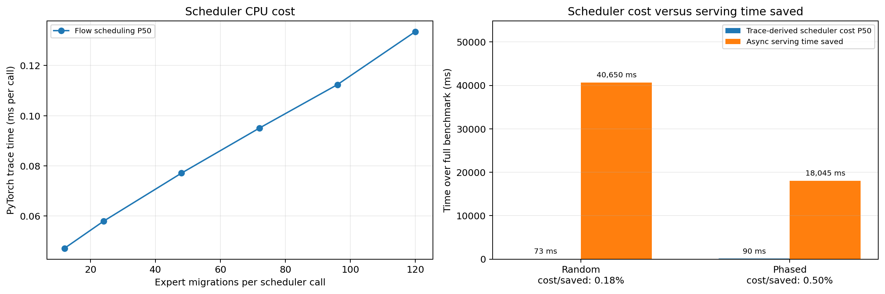

# Four-node NIXL EPLB migration batching

This benchmark uses Ubuntu 22.04.5, four Quadro RTX 6000 24 GB GPUs (one per
node), Ray 2.56.1, NIXL 1.3.2, and 10 GbE without RDMA. The tested source is
commit `83f052324b` on `ilp`, based on upstream `76ff0cdff2`. Prefix caching is
enabled in every run.

## Cluster setup

Pull `ilp` from a Windows terminal:

```bash
ssh cc@192.5.87.75 "cd ~/vllm-ilp && git switch ilp && git pull --ff-only origin ilp"
ssh -J cc@192.5.87.75 cc@10.140.83.20  "cd ~/vllm-ilp && git switch ilp && git pull --ff-only origin ilp"
ssh -J cc@192.5.87.75 cc@10.140.83.141 "cd ~/vllm-ilp && git switch ilp && git pull --ff-only origin ilp"
ssh -J cc@192.5.87.75 cc@10.140.83.105 "cd ~/vllm-ilp && git switch ilp && git pull --ff-only origin ilp"
```

On every node:

```bash
cd ~/vllm-ilp
export PATH=$PWD/.venv/bin:$HOME/.local/bin:$PATH
export LD_LIBRARY_PATH=$PWD/.venv/lib/python3.12/site-packages/nvidia/cu13/lib${LD_LIBRARY_PATH:+:$LD_LIBRARY_PATH}
export NCCL_IB_DISABLE=1 NCCL_SOCKET_FAMILY=AF_INET
export NCCL_SOCKET_IFNAME=eno2 GLOO_SOCKET_IFNAME=eno2
export UCX_TLS=all UCX_NET_DEVICES=eno2 UCX_RCACHE_MAX_UNRELEASED=1024
ray stop --force
```

Start the head:

```bash
ray start --head --node-ip-address=10.31.0.89 --port=6379 \
  --num-gpus=1 --disable-usage-stats
```

Start workers with `NODE_IP=10.31.0.87`, `10.31.0.94`, and `10.31.0.91`:

```bash
ray start --address=10.31.0.89:6379 --node-ip-address="$NODE_IP" \
  --num-gpus=1 --disable-usage-stats
```

## Server and benchmark commands

Use a fresh server for every sync/async and off/on run:

```bash
cd ~/vllm-ilp
export PATH=$PWD/.venv/bin:$HOME/.local/bin:$PATH
export LD_LIBRARY_PATH=$PWD/.venv/lib/python3.12/site-packages/nvidia/cu13/lib
export NCCL_IB_DISABLE=1 NCCL_SOCKET_FAMILY=AF_INET
export NCCL_SOCKET_IFNAME=eno2 GLOO_SOCKET_IFNAME=eno2
export UCX_TLS=all UCX_NET_DEVICES=eno2 UCX_RCACHE_MAX_UNRELEASED=1024
export VLLM_EPLB_LOG_MIGRATION_STATS=0

MODEL=Qwen/Qwen3-30B-A3B-Instruct-2507
USE_ASYNC=true     # repeat with false
USE_BATCHING=true  # repeat with false
EPLB_CONFIG="{\"window_size\":50,\"step_interval\":100,\"num_redundant_experts\":16,\"log_balancedness\":false,\"use_async\":$USE_ASYNC,\"communicator\":\"nixl\",\"enable_migration_batching\":$USE_BATCHING}"

vllm serve "$MODEL" --dtype float16 --port 8000 \
  --gpu-memory-utilization 0.8 --max-model-len 4096 \
  --enable-prefix-caching --tensor-parallel-size 4 \
  --distributed-executor-backend ray --enable-expert-parallel \
  --enable-eplb --eplb-config "$EPLB_CONFIG" --enforce-eager
```

Warm up each fresh server with eight requests:

```bash
vllm bench serve --backend vllm --model "$MODEL" --port 8000 \
  --dataset-name random --random-prefix-len 300 \
  --random-input-len 100 --random-output-len 300 \
  --num-prompts 8 --max-concurrency 8 --seed 123 --temperature 0 \
  --ignore-eos --disable-tqdm
```

### Random workload

```bash
vllm bench serve --backend vllm --model "$MODEL" --port 8000 \
  --dataset-name random --random-prefix-len 300 \
  --random-input-len 100 --random-output-len 300 \
  --num-prompts 200 --max-concurrency 32 --seed 0 --temperature 0 \
  --percentile-metrics ttft,tpot,e2el --metric-percentiles 50,90,95,99 \
  --ignore-eos --disable-tqdm --save-result \
  --result-dir "$RESULTS" --result-filename bench.json
```

### Phased-English workload

The tracked JSONL contains 256 ordered English prompts in eight 32-request
phases. It was generated deterministically by
`bench_dataset/generate_phased_english.py`; ordering is preserved to make the
expert distribution change repeatedly.

```bash
vllm bench serve --backend vllm --model "$MODEL" --port 8000 \
  --dataset-name custom \
  --dataset-path benchmarks/eplb_rebalance/bench_dataset/eplb_phased_english_256.jsonl \
  --disable-shuffle --custom-output-len 300 --num-prompts 256 \
  --max-concurrency 32 --seed 0 --temperature 0 \
  --percentile-metrics ttft,tpot,e2el --metric-percentiles 50,90,95,99 \
  --ignore-eos --disable-tqdm --save-result \
  --result-dir "$RESULTS" --result-filename bench.json
```

NIC P50/P99 is the head node's combined RX+TX rate, sampled from
`/sys/class/net/eno2/statistics/{rx_bytes,tx_bytes}` once per second. It is not
a `vllm bench serve` metric.

## End-to-end results

All requests succeeded. Raw JSON and logs are under
`results/serving_nixl_20260905/`.

### Random workload

| Mode | Batching | Duration (s) | Output (tok/s) | TTFT P50/P99 (ms) | TPOT P50/P99 (ms) | E2EL P50/P99 (ms) | NIC P50/P99 (MB/s) |
| --- | --- | ---: | ---: | ---: | ---: | ---: | ---: |
| sync | off | 2,331.63 | 25.73 | 29,369.51 / 48,692.09 | 1,047.12 / 1,146.84 | 343,648.96 / 365,870.13 | 107.03 / 643.49 |
| sync | on | 2,471.87 | 24.27 | 33,832.50 / 52,842.07 | 1,096.07 / 1,232.19 | 364,251.82 / 388,641.14 | 107.65 / 611.51 |
| async | off | 1,481.68 | 40.49 | 28,827.71 / 44,898.47 | 637.16 / 746.74 | 226,380.20 / 234,041.94 | 323.58 / 614.35 |
| async | on | 1,441.03 | 41.64 | 28,032.03 / 43,914.54 | 623.17 / 717.52 | 218,808.74 / 231,834.29 | 307.36 / 558.16 |

Batching raised throughput by 2.82% and reduced TTFT P50/P99 by 2.76%/2.19%,
TPOT P50/P99 by 2.20%/3.91%, E2EL P50/P99 by 3.34%/0.94%, and NIC P50/P99
by 5.01%/9.15% in async mode. In sync mode, throughput fell by 5.67% because
the conflict-free batches execute serially while inference is paused.

### Phased-English workload

| Mode | Batching | Duration (s) | Output (tok/s) | TTFT P50/P99 (ms) | TPOT P50/P99 (ms) | E2EL P50/P99 (ms) | NIC P50/P99 (MB/s) |
| --- | --- | ---: | ---: | ---: | ---: | ---: | ---: |
| sync | off | 2,907.92 | 26.41 | 40,482.84 / 96,627.16 | 1,096.95 / 1,205.97 | 362,827.06 / 371,150.66 | 107.86 / 655.86 |
| sync | on | 3,029.99 | 25.35 | 41,136.22 / 102,878.97 | 1,138.29 / 1,249.66 | 378,383.85 / 382,688.81 | 113.11 / 610.50 |
| async | off | 1,879.26 | 40.87 | 41,123.20 / 59,359.63 | 667.41 / 776.53 | 233,580.27 / 242,402.25 | 305.56 / 633.24 |
| async | on | 1,861.21 | 41.26 | 40,568.09 / 61,455.58 | 659.14 / 771.25 | 231,309.48 / 239,984.56 | 298.98 / 574.56 |

Batching raised throughput by 0.97% and reduced TTFT P50 by 1.35%, TPOT
P50/P99 by 1.24%/0.68%, E2EL P50/P99 by 0.97%/1.00%, and NIC P50/P99 by
2.15%/9.27% in async mode. TTFT P99 increased by 3.53%. In sync mode,
throughput fell by 4.03%.

Async EPLB is generally the relevant mode for production serving: migration
runs in the background while inference continues, so reducing NIC contention
reduces interference. Sync EPLB pauses inference, and splitting migration into
serial batches extends that pause. Sync users can retain the unbatched path with
`enable_migration_batching=false`.

The phased workload is closer to a changing production request mix. Random
token IDs change expert load less meaningfully, so they exercise migration
batching less consistently even when the number of transfers is similar.

## Scheduler profiling

PyTorch profiler replays six real four-rank placements with 12--120 expert
migrations per call. Each point has 50 warmups and 500 measured calls.

```bash
.venv/bin/python benchmarks/eplb_rebalance/profile_scheduler_trace.py \
  benchmarks/eplb_rebalance/results/scheduler_profile_20260905/placements \
  --warmup 50 --repeats 500 \
  --trace scheduler.pt.trace.json --summary summary.csv
```

| Expert migrations/call | Flow scheduling P50 (ms/call) |
| ---: | ---: |
| 12 | 0.047 |
| 24 | 0.058 |
| 48 | 0.077 |
| 72 | 0.095 |
| 96 | 0.112 |
| 120 | 0.133 |

For each observed scheduler call `i`, the P50 trace time is linearly
interpolated at its migration count `m_i`. The cumulative scheduler cost and
cost/saved ratio are:

$$
C_{P50}=\sum_i t_{P50}(m_i), \qquad
R_{P50}=\frac{C_{P50}}{(D_{off}-D_{on})\times1000}\times100\%.
$$

| Workload | Scheduler calls | Max migrations/call | Scheduler cost P50 (ms) | Serving time saved (ms) | Cost/saved |
| --- | ---: | ---: | ---: | ---: | ---: |
| Random | 630 | 118 | 72.91 | 40,650.40 | 0.18% |
| Phased English | 767 | 116 | 89.58 | 18,045.29 | 0.50% |



The compressed Chrome trace and summary are under
`results/scheduler_profile_20260905/`. The separate migration-stat runs used
the same server and benchmark parameters and are under
`results/migration_profile_20260905/`.

```bash
.venv/bin/python benchmarks/eplb_rebalance/analyze_optimized_profile.py \
  benchmarks/eplb_rebalance/results/scheduler_profile_20260905/summary.csv \
  benchmarks/eplb_rebalance/results/serving_nixl_20260905 \
  benchmarks/eplb_rebalance/results/serving_nixl_20260905 \
  --migration-log-dir \
  benchmarks/eplb_rebalance/results/migration_profile_20260905
```
