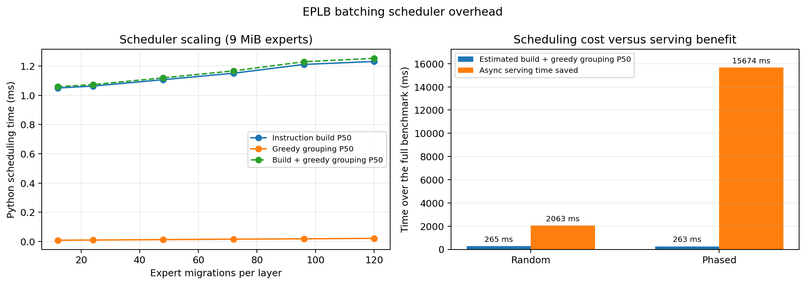

# Four-Node NIXL EPLB Migration Batching Experiment

Both workloads below keep prefix caching enabled. Run four configurations for
each workload: `sync/off`, `sync/on`, `async/off`, and `async/on`.
Migration batching is enabled by default; set it to `false` for rollback.

Environment: Ubuntu 22.04.5, four Quadro RTX 6000 24 GB GPUs (one per
node), NVIDIA 580.167.08, Ray 2.56.1, NIXL 1.3.2, and 10 GbE. The tested
source is the `ilp` branch based on upstream commit `76ff0cdff2`.

## 1. Pull the Code

Run in a Windows terminal:

```bash
ssh cc@192.5.87.75 "cd ~/vllm-ilp && git switch ilp && git pull --ff-only origin ilp"
ssh -J cc@192.5.87.75 cc@10.140.83.20  "cd ~/vllm-ilp && git switch ilp && git pull --ff-only origin ilp"
ssh -J cc@192.5.87.75 cc@10.140.83.141 "cd ~/vllm-ilp && git switch ilp && git pull --ff-only origin ilp"
ssh -J cc@192.5.87.75 cc@10.140.83.105 "cd ~/vllm-ilp && git switch ilp && git pull --ff-only origin ilp"
```

## 2. Start Ray

Run on all four nodes:

```bash
cd ~/vllm-ilp
export PATH=$PWD/.venv/bin:$HOME/.local/bin:$PATH
export LD_LIBRARY_PATH=$PWD/.venv/lib/python3.12/site-packages/nvidia/cu13/lib${LD_LIBRARY_PATH:+:$LD_LIBRARY_PATH}
export NCCL_IB_DISABLE=1 NCCL_SOCKET_FAMILY=AF_INET
export NCCL_SOCKET_IFNAME=eno2 GLOO_SOCKET_IFNAME=eno2
export UCX_TLS=all UCX_NET_DEVICES=eno2 UCX_RCACHE_MAX_UNRELEASED=1024
ray stop --force
```

Run on the head node (`10.31.0.89`):

```bash
ray start --head --node-ip-address=10.31.0.89 --port=6379 \
  --num-gpus=1 --disable-usage-stats
```

Run on the workers, using `10.31.0.87`, `10.31.0.94`, and `10.31.0.91`
respectively as `NODE_IP`:

```bash
ray start --address=10.31.0.89:6379 --node-ip-address="$NODE_IP" \
  --num-gpus=1 --disable-usage-stats
```

`ray status` on the head node should report four active nodes and four GPUs.

## 3. Start vLLM

Choose one configuration before each run:

Every run explicitly uses NIXL, so batching is the only variable between each
off/on pair. On this cluster NIXL uses UCX over the 10 GbE `eno2` network; the
nodes do not have RDMA devices.

```bash
# Synchronous, batching disabled
TAG=01_sync_off
USE_ASYNC=false
USE_BATCHING=false
COMMUNICATOR=nixl

# Synchronous, batching enabled
TAG=02_sync_batching_on
USE_ASYNC=false
USE_BATCHING=true
COMMUNICATOR=nixl

# Asynchronous, batching disabled
TAG=03_async_off
USE_ASYNC=true
USE_BATCHING=false
COMMUNICATOR=nixl

# Asynchronous, batching enabled
TAG=04_async_batching_on
USE_ASYNC=true
USE_BATCHING=true
COMMUNICATOR=nixl
```

Select the result root for the workload being tested:

```bash
# Set WORKLOAD to random or phased.
RESULTS_ROOT=$HOME/benchmarks/eplb_nixl_cache_on_20260901/$WORKLOAD
```

Start a fresh service for every configuration:

```bash
cd ~/vllm-ilp
export PATH=$PWD/.venv/bin:$HOME/.local/bin:$PATH
export LD_LIBRARY_PATH=$PWD/.venv/lib/python3.12/site-packages/nvidia/cu13/lib${LD_LIBRARY_PATH:+:$LD_LIBRARY_PATH}
export NCCL_IB_DISABLE=1 NCCL_SOCKET_FAMILY=AF_INET
export NCCL_SOCKET_IFNAME=eno2 GLOO_SOCKET_IFNAME=eno2
export UCX_TLS=all UCX_NET_DEVICES=eno2 UCX_RCACHE_MAX_UNRELEASED=1024
export VLLM_EPLB_LOG_MIGRATION_STATS=1

MODEL=Qwen/Qwen3-30B-A3B-Instruct-2507
RESULTS=$RESULTS_ROOT/$TAG
mkdir -p "$RESULTS"

EPLB_CONFIG="{\"window_size\":50,\"step_interval\":100,\"num_redundant_experts\":16,\"log_balancedness\":false,\"use_async\":$USE_ASYNC,\"communicator\":\"$COMMUNICATOR\",\"enable_migration_batching\":$USE_BATCHING}"

vllm serve "$MODEL" --dtype float16 --port 8000 \
  --gpu-memory-utilization 0.8 --max-model-len 4096 \
  --enable-prefix-caching --tensor-parallel-size 4 \
  --distributed-executor-backend ray --enable-expert-parallel \
  --enable-eplb --eplb-config "$EPLB_CONFIG" --enforce-eager \
  > "$RESULTS/server.log" 2>&1 &
SERVER_PID=$!

until curl -sf http://127.0.0.1:8000/health >/dev/null; do sleep 5; done

curl -sf http://127.0.0.1:8000/v1/completions \
  -H "Content-Type: application/json" \
  -d "{\"model\":\"$MODEL\",\"prompt\":\"warm up\",\"max_tokens\":10}" \
  > "$RESULTS/warmup.json"

while kill -0 "$SERVER_PID"; do
  echo "$(date +%s) $(cat /sys/class/net/eno2/statistics/{rx_bytes,tx_bytes} | xargs)"
  sleep 1
done > "$RESULTS/nic.tsv" &
NIC_PID=$!
```

## 4. Choose One Benchmark Workload

### A. Random workload

This is the ordinary synthetic workload. It has a 300-token shared prefix and
200 random input tokens. Prefix caching remains enabled by the server.

```bash
vllm bench serve --backend vllm --model "$MODEL" --port 8000 \
  --dataset-name random --random-prefix-len 300 \
  --random-input-len 200 --random-output-len 100 \
  --num-prompts 200 --max-concurrency 32 --seed 0 --temperature 0 \
  --percentile-metrics ttft,tpot,e2el \
  --metric-percentiles 50,90,95,99 --ignore-eos --disable-tqdm \
  --save-result --result-dir "$RESULTS" --result-filename bench.json \
  > "$RESULTS/bench.log" 2>&1
```

Results are stored under:

```text
/home/cc/benchmarks/eplb_nixl_cache_on_20260901/random/
```

### B. Phased English workload

The JSONL contains 256 English prompts in eight ordered phases of 32 requests:
CUDA, literature, mathematics, and biomedical prompts, repeated twice. The
ordered domain changes make the expert distribution move repeatedly. Each
prompt retains a common 223-token prefix, so prefix caching is still exercised.

The exact JSONL used for the experiment is tracked in the repository at:

```text
benchmarks/eplb_rebalance/bench_dataset/eplb_phased_english_256.jsonl
```

It was generated deterministically by
`bench_dataset/generate_phased_english.py`. Its SHA-256 is
`15f80f77caf13b44c1ee715a2db0663daf6a5f884fcbb5769998b46b86482dda`.
The experiment directory also retains an identical archived copy under
`workload/`.

If the custom loader reports that bench support is missing, install its required
dependency on the head node:

```bash
uv pip install --python $HOME/.venv/bin/python pandas
```

Run it without shuffling so the phases remain ordered:

```bash
DATASET=$HOME/vllm-ilp/benchmarks/eplb_rebalance/bench_dataset/eplb_phased_english_256.jsonl

vllm bench serve --backend vllm --model "$MODEL" --port 8000 \
  --dataset-name custom --dataset-path "$DATASET" --disable-shuffle \
  --custom-output-len 100 --num-prompts 256 --max-concurrency 32 \
  --seed 0 --temperature 0 --percentile-metrics ttft,tpot,e2el \
  --metric-percentiles 50,90,95,99 --ignore-eos --disable-tqdm \
  --save-result --result-dir "$RESULTS" --result-filename bench.json \
  > "$RESULTS/bench.log" 2>&1
```

Results are stored under:

```text
/home/cc/benchmarks/eplb_nixl_cache_on_20260901/phased/
```

Stop the sampler and service after each run:

```bash
kill "$NIC_PID" "$SERVER_PID"
```

## 5. Results

Raw `vllm bench serve` JSON, logs, NIXL migration logs, and NIC counters are
tracked under `results/nixl_cache_on_20260901/`. The eight `bench.json` files
are copied without modification from the benchmark host.

### Random workload, prefix cache enabled

| Mode | Batching | Duration (s) | Output (tok/s) | TTFT P50/P99 (ms) | TPOT P50/P99 (ms) | E2EL P50/P99 (ms) | NIC P50/P99 (MB/s) |
| --- | --- | ---: | ---: | ---: | ---: | ---: | ---: |
| sync | off | 1225.67 | 16.32 | 54,949.85 / 105,060.03 | 1,333.81 / 1,755.24 | 179,673.86 / 229,069.08 | 103.45 / 638.01 |
| sync | on | 1268.53 | 15.77 | 55,243.32 / 109,274.41 | 1,388.90 / 1,791.22 | 184,111.53 / 242,900.86 | 104.92 / 601.87 |
| async | off | 911.96 | 21.93 | 44,034.71 / 84,746.04 | 958.17 / 1,403.48 | 143,472.08 / 167,108.97 | 147.70 / 600.65 |
| async | on | 909.89 | 21.98 | 45,101.53 / 83,907.46 | 954.75 / 1,373.28 | 140,172.10 / 164,365.94 | 147.83 / 532.94 |

### Phased English workload, prefix cache enabled

| Mode | Batching | Duration (s) | Output (tok/s) | TTFT P50/P99 (ms) | TPOT P50/P99 (ms) | E2EL P50/P99 (ms) | NIC P50/P99 (MB/s) |
| --- | --- | ---: | ---: | ---: | ---: | ---: | ---: |
| sync | off | 1206.40 | 21.22 | 40,660.05 / 95,322.51 | 1,059.48 / 1,432.08 | 145,794.50 / 187,949.84 | 132.63 / 623.87 |
| sync | on | 1289.34 | 19.86 | 40,479.45 / 101,582.30 | 1,151.07 / 1,532.98 | 155,496.94 / 202,328.61 | 136.27 / 577.08 |
| async | off | 837.61 | 30.56 | 39,621.82 / 62,807.27 | 678.23 / 1,020.25 | 105,159.68 / 109,422.29 | 155.93 / 643.02 |
| async | on | 821.94 | 31.15 | 38,989.77 / 61,621.68 | 644.59 / 998.16 | 102,613.37 / 106,512.01 | 156.01 / 578.14 |

The main comparison for the proposed optimization is `03_async_off` versus
`04_async_batching_on`. Batching improved output throughput by 0.23% and 1.91%,
reduced TPOT P50 by 0.36% and 4.96%, and reduced NIC P99 by 11.27% and 10.09%
for the random and phased workloads, respectively. Sync mode pauses inference;
its batching overhead reduced throughput in both workloads.

`batches` is calculated from each layer's migration graph; it is not configured
as the constant value six. These runs happened to produce six batches per
layer when batching was enabled.

## 6. Scheduler Profiling

This profile measures how Python scheduling cost scales with the number of
expert migrations. It fixes the topology at four ranks, 32 physical slots per
rank, 12 directed rank-pair flows, six batches, and 9 MiB per expert. Each point
has 500 scheduler repetitions; the raw files also retain ten alternating
off/on NIXL migrations after two warmups.

Run the following command on all four nodes, changing `NODE_RANK` from 0 to 3.
Repeat it with `MIGRATIONS_PER_FLOW=1,2,4,6,8,10`.

```bash
NODE_RANK=0
EXPERT_BYTES=9437184
MIGRATIONS_PER_FLOW=1

cd ~/vllm-ilp
export LD_LIBRARY_PATH=$PWD/.venv/lib/python3.12/site-packages/nvidia/cu13/lib
export NCCL_IB_DISABLE=1 NCCL_SOCKET_FAMILY=AF_INET
export NCCL_SOCKET_IFNAME=eno2 GLOO_SOCKET_IFNAME=eno2
export UCX_TLS=all UCX_NET_DEVICES=eno2 UCX_RCACHE_MAX_UNRELEASED=1024

.venv/bin/python -m torch.distributed.run --nnodes=4 --nproc-per-node=1 \
  --node-rank=$NODE_RANK --master-addr=10.31.0.89 --master-port=29606 \
  benchmarks/eplb_rebalance/profile_nixl_migration.py \
  --expert-bytes=$EXPERT_BYTES \
  --migrations-per-flow=$MIGRATIONS_PER_FLOW \
  --warmup=2 --repeats=10 \
  --scheduler-repeats=500 --output=$HOME/profile.json
```

Qwen3-30B-A3B has `hidden_size=2048` and
`moe_intermediate_size=768`. Its two FP16 expert matrices total exactly 9 MiB
per expert, so the 9 MiB point matches the model used by the serving benchmark.

| Migrations/layer | Build P50/P99 (ms) | Greedy P50/P99 (ms) | Total P50/P99 (ms) |
| ---: | ---: | ---: | ---: |
| 12 | 1.050 / 1.188 | 0.008 / 0.019 | 1.058 / 1.197 |
| 24 | 1.063 / 1.179 | 0.010 / 0.015 | 1.073 / 1.191 |
| 48 | 1.106 / 1.599 | 0.013 / 0.020 | 1.119 / 1.618 |
| 72 | 1.151 / 1.339 | 0.016 / 0.026 | 1.167 / 1.357 |
| 96 | 1.211 / 1.472 | 0.018 / 0.034 | 1.229 / 1.493 |
| 120 | 1.231 / 1.376 | 0.021 / 0.033 | 1.253 / 1.402 |

Instruction construction includes a scan of the fixed 128-expert placement,
while greedy grouping grows with the migration count. The total P50 increased
by only 0.195 ms from 12 to 120 migrations.

For a like-for-like cost comparison, the analysis reads the migration count of
every layer from the existing async batching-on server logs, interpolates the
measured P50 scheduler cost, and sums it over the full benchmark:

$$
C_{\mathrm{sched}} = \sum_i
T_{50}\!\left(m_i\right)
$$

Here, $m_i$ is the number of expert migrations in layer migration $i$, and
$T_{50}(m_i)$ is the interpolated P50 instruction-build plus greedy-grouping
time. The serving time saved and cost-to-saving ratio are:

$$
S = \left(D_{\mathrm{async,off}} - D_{\mathrm{async,on}}\right) \times 1000
$$

$$
R = \frac{C_{\mathrm{sched}}}{S} \times 100\%.
$$

All four ranks schedule concurrently. The profile pools individual per-rank
timings rather than summing them, so $C_{\mathrm{sched}}$ already represents a
typical rank's cumulative time and must not be divided by four again. If total
cluster CPU work were summed first, ideal four-rank parallelism would give
$C_{\mathrm{cluster}} / 4 \approx C_{\mathrm{sched}}$.

| Workload | Layer migrations | Expert migrations | Build + greedy P50 estimate (ms) | Serving time saved (ms) | Overhead ratio |
| --- | ---: | ---: | ---: | ---: | ---: |
| Random | 215 | 21,669 | 265 | 2,063 | 12.85% |
| Phased English | 213 | 21,480 | 263 | 15,674 | 1.67% |

Thus the estimated scheduling cost remained below the measured async serving
time saved in both workloads. The phased workload is more representative of
production traffic; the random-number workload changes expert load less and
therefore exercises the batching feature less. These ratios use one existing
off/on serving run per workload, so they are cost estimates rather than
confidence-bounded performance claims. They are also conservative because
migration-stat logging builds instructions in the off runs, while the estimate
charges the full instruction-build and greedy cost to batching.



The six unmodified JSON files, all 24 rank logs, and both generated CSV files
are in `results/nixl_scheduler_scaling_20260904/`. Regenerate the tables and
figure with:

```bash
.venv/bin/python benchmarks/eplb_rebalance/analyze_scheduler_scaling.py \
  benchmarks/eplb_rebalance/results/nixl_scheduler_scaling_20260904
```
