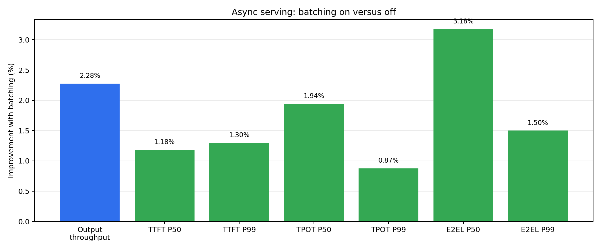
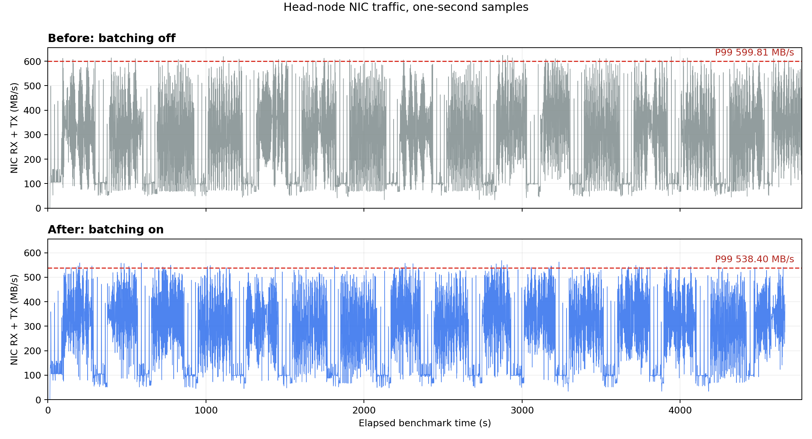
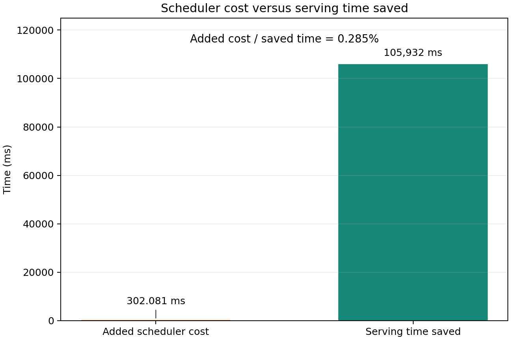

# Four-node NIXL EPLB migration batching

Ubuntu 22.04.5, 4 × Quadro RTX 6000 24 GB (one GPU per node), Ray 2.56.1,
NIXL 1.3.2, and 10 GbE without RDMA. Prefix caching is enabled. Every result is
a single run with a fresh server and an eight-request warm-up.

Migration batching is used only by async EPLB. Sync EPLB pauses inference, so
serial transfer batches would only extend the pause; it always keeps the
original unbatched path.

## Cluster

Head: `10.31.0.89`. Workers: `10.31.0.87`, `10.31.0.94`, `10.31.0.91`.

```bash
ray start --head --node-ip-address=10.31.0.89 --port=6379 \
  --num-gpus=1 --disable-usage-stats
```

Run this on each worker after setting its `NODE_IP`:

```bash
ray start --address=10.31.0.89:6379 --node-ip-address="$NODE_IP" \
  --num-gpus=1 --disable-usage-stats
```

## Commands

Repeat the server once with `USE_BATCHING=false` and once with `true`:

```bash
export NCCL_IB_DISABLE=1 NCCL_SOCKET_FAMILY=AF_INET
export NCCL_SOCKET_IFNAME=eno2 GLOO_SOCKET_IFNAME=eno2
export UCX_TLS=all UCX_NET_DEVICES=eno2 UCX_RCACHE_MAX_UNRELEASED=1024
export VLLM_EPLB_LOG_MIGRATION_STATS=0

MODEL=Qwen/Qwen3-30B-A3B-Instruct-2507
USE_BATCHING=true
EPLB_CONFIG="{\"window_size\":50,\"step_interval\":50,\"num_redundant_experts\":32,\"log_balancedness\":false,\"use_async\":true,\"communicator\":\"nixl\",\"enable_migration_batching\":$USE_BATCHING}"

vllm serve "$MODEL" --dtype float16 --port 8000 \
  --gpu-memory-utilization 0.9 --max-model-len 4096 \
  --enable-prefix-caching --tensor-parallel-size 4 \
  --distributed-executor-backend ray --enable-expert-parallel \
  --enable-eplb --eplb-config "$EPLB_CONFIG" --enforce-eager
```

Warm-up:

```bash
vllm bench serve --backend vllm --model "$MODEL" --port 8000 \
  --dataset-name random --random-prefix-len 300 \
  --random-input-len 200 --random-output-len 300 \
  --num-prompts 8 --max-concurrency 8 --seed 123 --temperature 0 \
  --ignore-eos --disable-tqdm
```

Measured workload:

```bash
vllm bench serve --backend vllm --model "$MODEL" --port 8000 \
  --dataset-name random --random-prefix-len 300 \
  --random-input-len 200 --random-output-len 300 \
  --num-prompts 500 --max-concurrency 32 --seed 0 --temperature 0 \
  --percentile-metrics ttft,tpot,e2el --metric-percentiles 50,99 \
  --ignore-eos --disable-tqdm --save-result \
  --result-dir "$RESULTS" --result-filename bench.json
```

## End-to-end result

All 500 requests succeeded in both cases. Nsight and diagnostic migration
logging were disabled. Lower is better for all latency columns.

| Batching | Duration (s) | Request/s | Output tok/s | TTFT P50/P99 (ms) | TPOT P50/P99 (ms) | E2EL P50/P99 (ms) |
| --- | ---: | ---: | ---: | ---: | ---: | ---: |
| off | 4,756.10 | 0.1051 | 31.54 | 49,180.71 / 75,740.25 | 828.53 / 1,007.82 | 303,462.69 / 322,184.88 |
| on | 4,650.17 | 0.1075 | 32.26 | 48,599.04 / 74,756.17 | 812.44 / 999.01 | 293,821.76 / 317,351.61 |

Batching raised output throughput by 2.28% and reduced TTFT P50/P99 by
1.18%/1.30%, TPOT P50/P99 by 1.94%/0.87%, and E2EL P50/P99 by 3.18%/1.50%.



The head node's total network traffic (bytes received + bytes transmitted) was
sampled from Linux byte counters once per second; it is not a
`vllm bench serve` metric. Batching reduced NIC P99 from 599.81 MB/s to
538.40 MB/s (10.24%).



Raw JSON, logs, one-second NIC samples, summaries, and the plotting source are
in `results/serving_nixl_20260911_async_random500/`.

## Scheduler profiling

The async batching-on case is captured with the same server, warm-up, and
500-request workload above. Only NVTX-only Nsight capture is enabled. Search
each report for `eplb: schedule migration batches`; one range is one scheduling
call for all model layers. All ranks made 34 calls during the formal window.

| Rank | Calls | P50/call (ms) | Total time across all calls (ms) |
| ---: | ---: | ---: | ---: |
| 0 | 34 | 7.819 | 302.081 |
| 1 | 34 | 7.090 | 253.152 |
| 2 | 34 | 7.035 | 255.239 |
| 3 | 34 | 7.005 | 241.190 |

The four ranks schedule concurrently, so their times are not added. Across the
34 cycle-wide calls, rank 0 had the largest measured total scheduling time:
302.081 ms. The independent clean A/B benchmark completed 105.932 s faster
with batching. Comparing these measured values gives a
scheduler-cost-to-serving-time-saved ratio of 0.285%. The profiled run
completed 500/500 requests in 4,652.217 s.



Raw four-rank traces, benchmark output, timestamps, profile summary, and exact
commands are in `results/serving_nixl_20260911_async_random500_profile/`.
